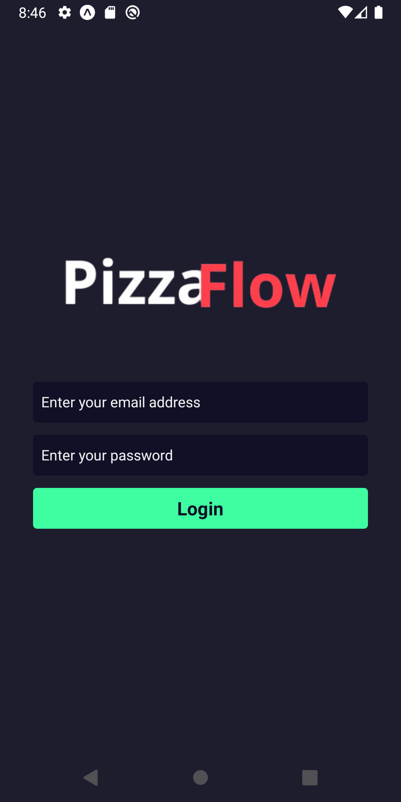
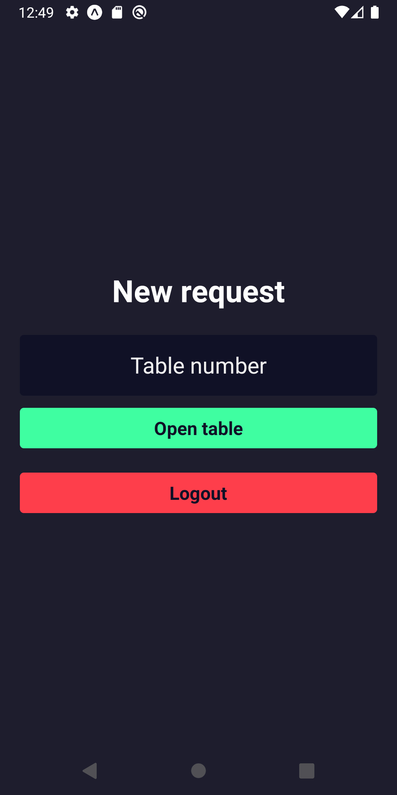
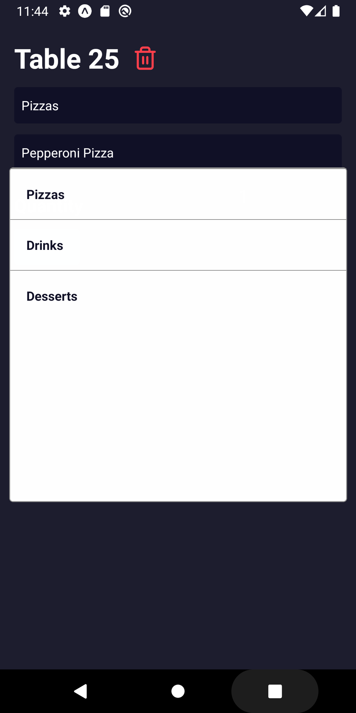
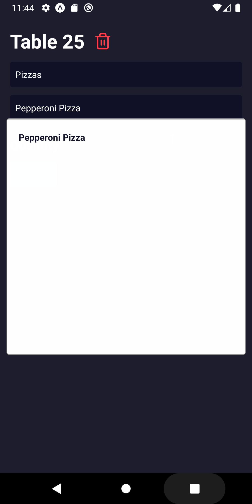
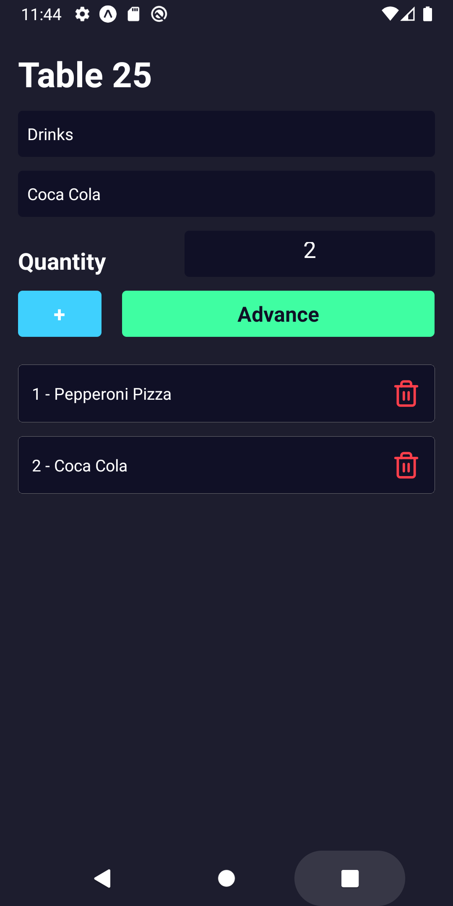
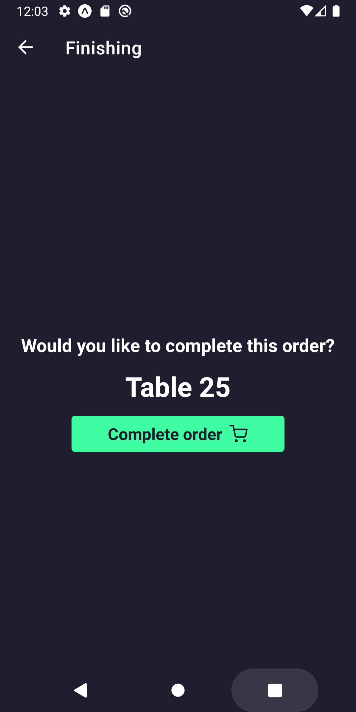

# PizzaFlow — Waiter & Kitchen App

> Mobile app for waitstaff to open tables, build orders, and for the kitchen to confirm order completion — all in real time.

This is the **Waiter & Kitchen Panel** of the PizzaFlow system — a full-stack restaurant management platform split across two environments. This app runs on **tablet or mobile** and is used by the restaurant's front-of-house and kitchen staff. The companion panel ([pizzaflow-admin](https://github.com/nathalliavieira/pizzaflow-admin)) runs on **desktop** and is used by the restaurant administration.

---

## 📸 Screenshots

| Login | New Request — Open Table |
|-------|--------------------------|
|  |  |

| Select Category | Select Product |
|-----------------|----------------|
|  |  |

| Building the Order | Finishing — Confirm Completion |
|--------------------|-------------------------------|
|  |  |

---

## ✨ Features

- 🔐 Authentication — secure login for waitstaff
- 🪑 Table management — open a new table by number
- 🗂️ Category & product selection — browse menu categories and products from the shared backend
- 🛒 Order building — add items with quantity control, review and remove items before sending
- ✅ Order completion — kitchen confirms when the order is ready and marks it as complete

---

## 🔄 Order Flow

```
Waiter logs in
    ↓
Opens a table (e.g. Table 25)
    ↓
Selects a category (Pizzas / Drinks / Desserts)
    ↓
Selects a product and sets quantity
    ↓
Adds more items or advances
    ↓
Kitchen receives the order and confirms completion
```

---

## 🛠️ Tech Stack


> ⚠️ Please confirm the tech stack above and adjust if needed (e.g. if Expo is not used).

---

## 🔗 Related Repositories

This project is part of the **PizzaFlow** ecosystem:

| Repository | Description | Environment |
|---|---|---|
| [pizzaflow-admin](https://github.com/nathalliavieira/pizzaflow-admin) | Admin panel — menu & order management | 🖥️ Desktop |
| **pizzaflow-mobile** (this repo) | Waiter & kitchen app — table and order flow | 📱 Tablet / Mobile |

Both share the same backend API.

---

## 🚀 Getting Started

### Prerequisites

- Node.js 18+
- The shared backend API running

### Installation

```bash
# Clone the repository
git clone https://github.com/nathalliavieira/pizzaflow-mobile
cd pizzaflow-mobile

# Install dependencies
npm install

# Set up environment variables
cp copy.env .env
# Edit .env with your API URL
```

### Environment Variables

```env
API_URL=your_backend_api_url
```

### Running locally

```bash
npm run dev
```
